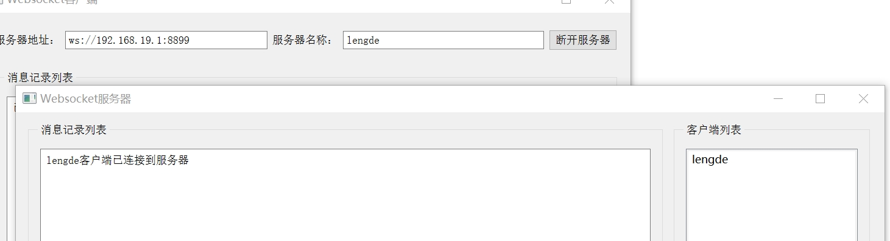
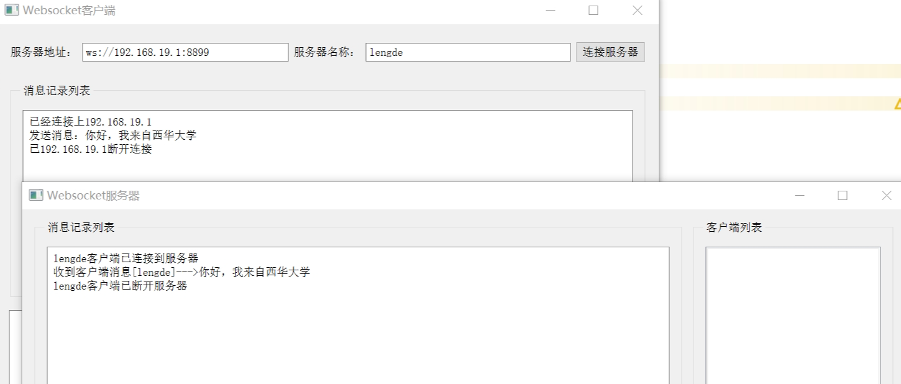
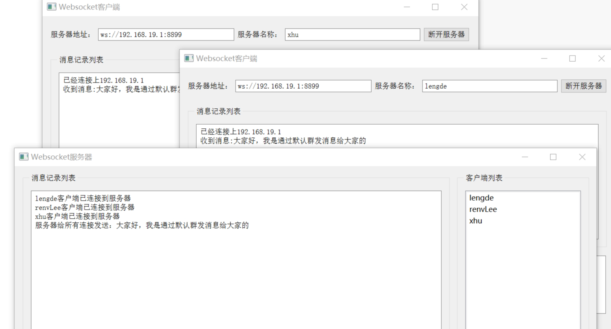
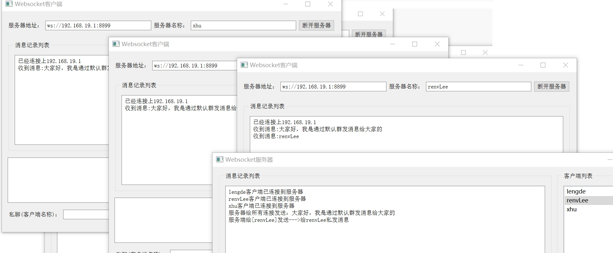
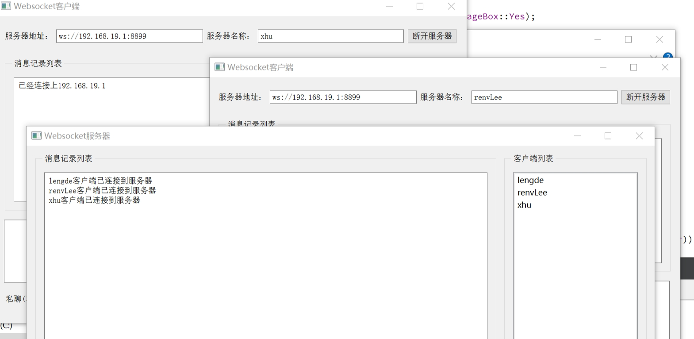
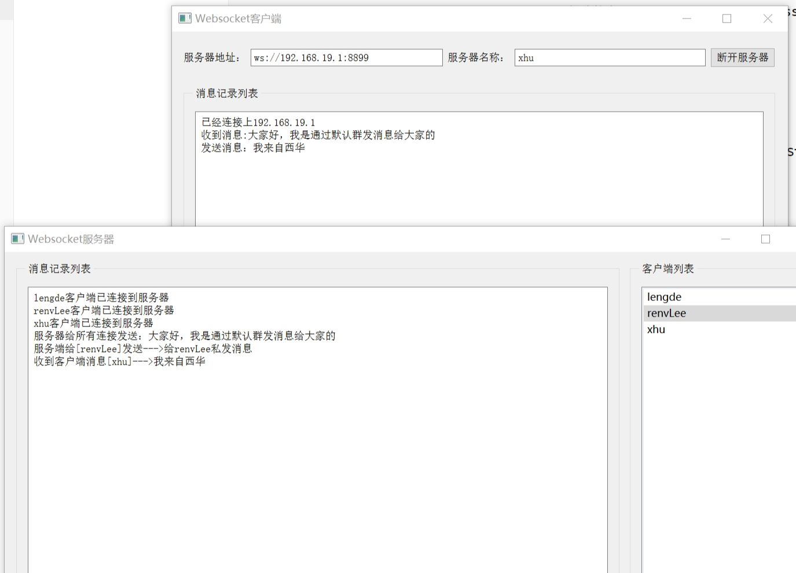

# 服务端

## 创建服务器



```C++
   // WS（服务器以非安全模式运行）
    // WSS（服务器以安全械运行）
    websocketserver=new QWebSocketServer(QStringLiteral("testServer"),
                                         QWebSocketServer::NonSecureMode,this);

    connect(websocketserver,&QWebSocketServer::newConnection,this,&Widget::getnewconnect);

    websocketserver->listen(QHostAddress::Any,8899);
```

## 建立信号与槽函数（断开连接，收到客户端消息，连接错误处理）



```C++
  connect(websocket,&QWebSocket::disconnected,this,[websocket,this]
        {
            ui->textEdit_MsgList->append(websocket->origin()+"客户端已断开服务器");
            websocketlist.removeOne(websocket);
            for(int i=0;i<ui->listWidget_Client->count();i++)
            {
                QListWidgetItem *item=ui->listWidget_Client->item(i);

                if(item->text()==websocket->origin())
                {
                    ui->listWidget_Client->removeItemWidget(item);
                    delete item;
                    break;
                }
            }
            websocket->deleteLater();
        });

        connect(websocket,&QWebSocket::textMessageReceived,this,&Widget::receiveMsg);
        connect(websocket,SIGNAL(error(QAbstractSocket::SocketError)),this,SLOT(onerrorFunc(QAbstractSocket::SocketError)));
```

## 服务器群发消息



## 服务器私发消息



# 客户端

## 与服务器建立连接



```C++
       // 判断服务器名称是否为空
        if(ui->lineEdit_ServerName->text().trimmed().isEmpty())
        {
            QMessageBox::critical(this,"错误","服务器名称不能为空，请重新检查!",QMessageBox::Yes);
            return;
        }

        websocket=new QWebSocket(ui->lineEdit_ServerName->text().trimmed(),QWebSocketProtocol::VersionLatest,this);
        connect(websocket,&QWebSocket::connected,this,[this]
        {
            ui->textEdit_MsgList->append("已经连接上"+websocket->peerAddress().toString());
            bConnect=true;
            ui->pushButton_Connect->setText("断开服务器");
        });

        connect(websocket,&QWebSocket::disconnected,this,[this]
        {
            ui->textEdit_MsgList->append("已"+websocket->peerAddress().toString()+"断开连接");
            bConnect=false;
            ui->pushButton_Connect->setText("连接服务器");
        });

        connect(websocket,SIGNAL(error(QAbstractSocket::SocketError)),this,SLOT(onerrorFunc(QAbstractSocket::SocketError)));
        connect(websocket,&QWebSocket::textMessageReceived,this,&Widget::receviedMsgFunc);
```

## 客户端向服务器发消息





